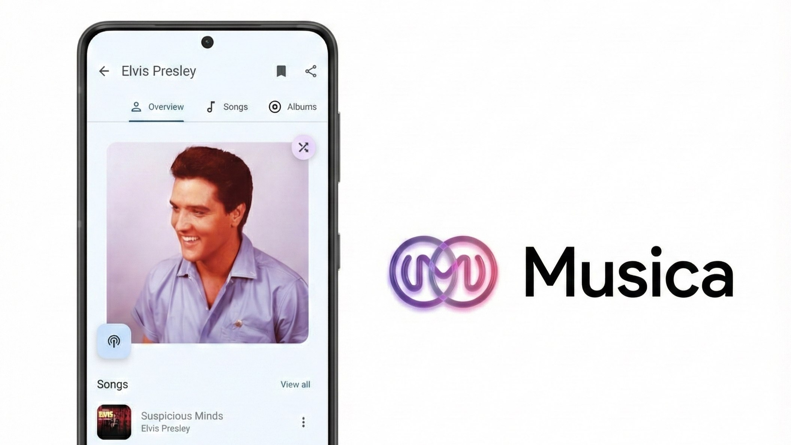
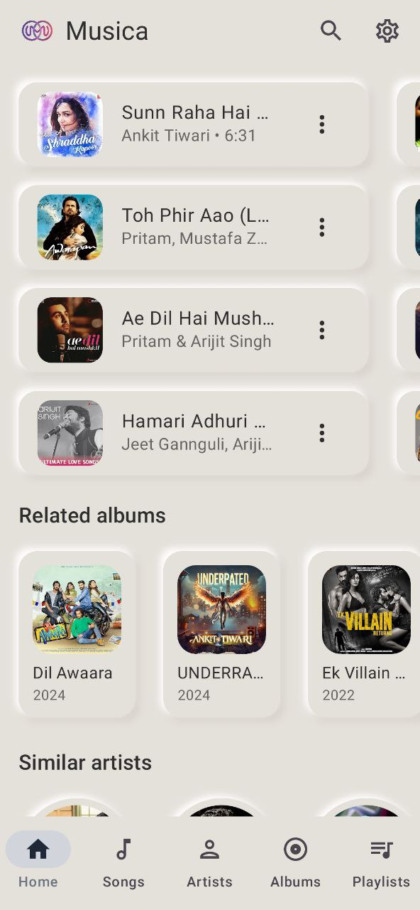
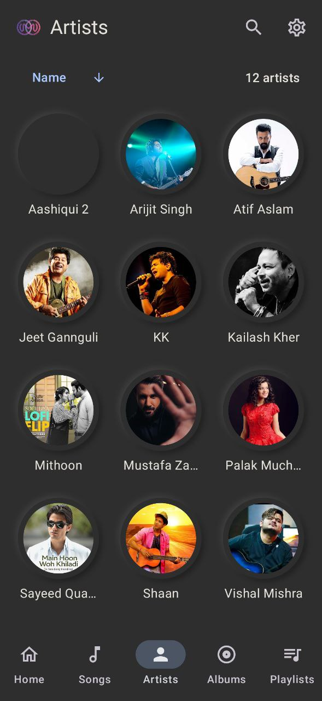
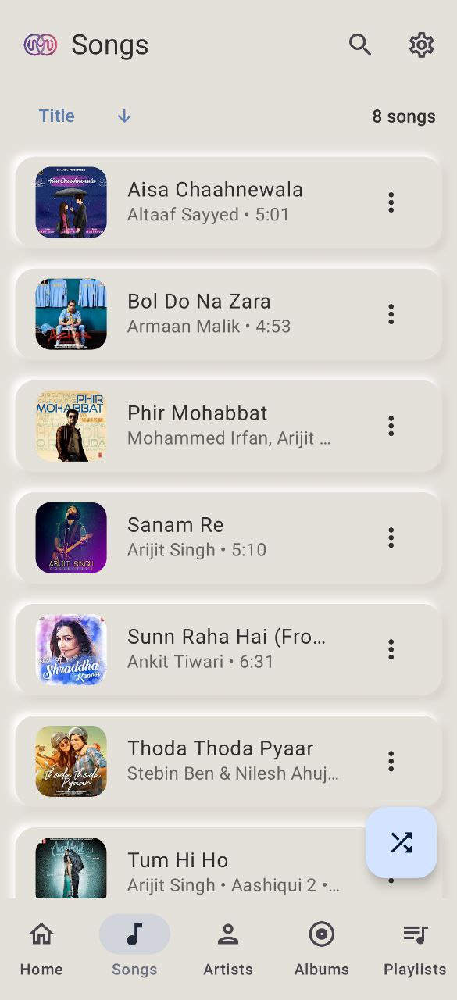
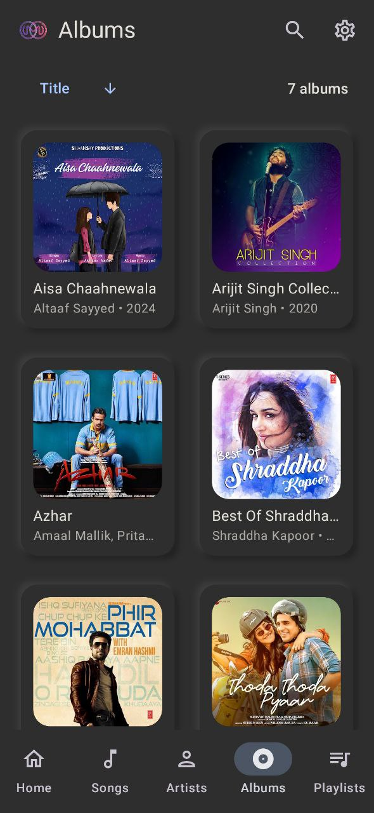

# Musica

An Android application for streaming music from YouTube Music.

## ✨ Core Features

### 🎧 Music Sync (Listen Together)
**Real-time synchronization** with friends!
- **Host & Join:** One person controls the music, everyone listens in perfect sync.
- **Cross-Device:** Works seamlessly across Android devices.
- **Low Latency:** Optimized for instant play/pause/seek syncing.

### 🚀 Standard Features
- Background playback
- Cache songs for offline playback
- Search for songs, albums, artists, videos and playlists
- Bookmark artists and albums
- Import playlists and manage local playlists
- Fetch, display and edit songs lyrics or synchronized lyrics
- Open YouTube and YouTube Music links by default
- Player features, such as sleep timer and persistent queue
- Audio features, such as skip silence and audio normalization
- Android Auto support

## 🌐 Available languages

- English
- Spanish
- German ([@siggi1984](https://github.com/siggi1984))
- French ([@patxixi](https://github.com/patxixi) and [@Mickael81](https://github.com/Mickael81))
- Italian ([@F3FFO](https://github.com/F3FFO))

## 📸 Screenshots

    
    
    
    
    
    

## 📲 Installation

## 🌟 Inspiration

- [ViMusic](https://github.com/vfsfitvnm/ViMusic)
- [RiMusic](https://github.com/fast4x/RiMusic)
- [ViTune](https://github.com/25huizengek1/ViTune)
- [InnerTune](https://github.com/z-huang/InnerTune)
- [OuterTune](https://github.com/OuterTune/OuterTune)
- [Symphony](https://github.com/zyrouge/symphony)

## ℹ️ Disclaimer

This project and its contents are not affiliated with, funded, authorized, endorsed by, or in any
way associated with YouTube, Google LLC or any of its affiliates and subsidiaries.

Any trademark, service mark, trade name, or other intellectual property rights used in this project
are owned by the respective owners.