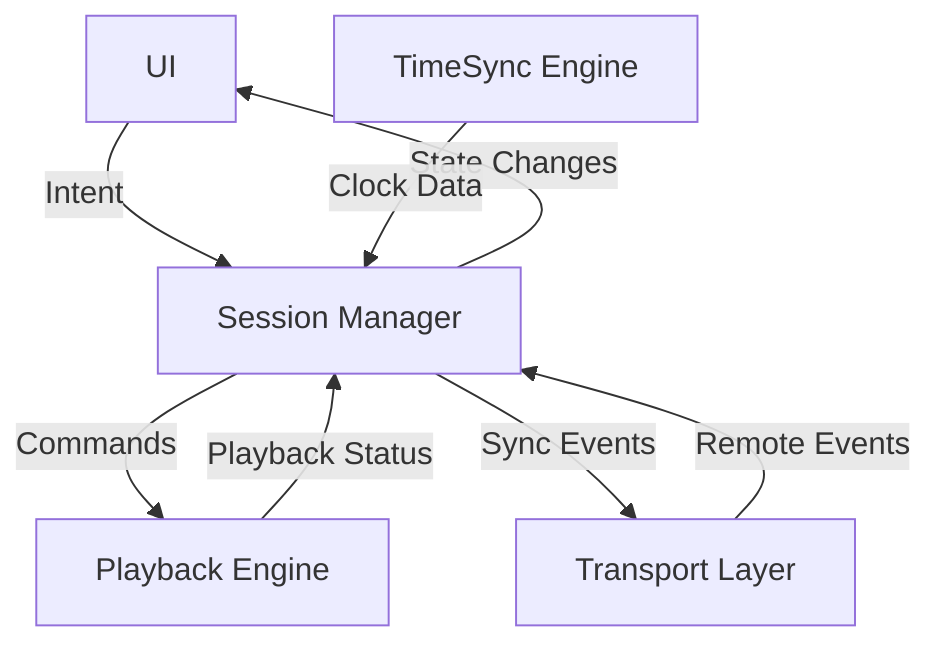

# Layer Responsibility Specification

## Overview
The architecture follows a strict **Star Topology** centered on the **SessionManager**. This ensures a single source of truth and prevents state inconsistencies.

**Core Principle**: "All inputs flow into Session Manager; all commands flow out of Session Manager."

## 1. Session Manager (`com.github.musicyou.sync.session`)

**Role**: The **Central Authority** and **Orchestrator**. It is the only component allowed to make decisions.

### Responsibilities:
-   **State Management**: Maintains the `SessionState` (PlaybackStatus, Track, GlobalTimestamp, Users).
-   **Decision Making**:
    -   Receives Clock Offset from TimeSync → Decides if/when to trigger a drift correction.
    -   Receives Play/Pause intention from UI → Validates → Broadcasts to Transport & Updates Playback.
    -   Receives Remote Events from Transport → Updates Playback.
-   **Host Logic**: If Host, acts as the authoritative source of events.
-   **Participant Logic**: If Participant, follows Host events effectively.

### Dependencies:
-   `TimeSyncEngine` (Input: Clock Data)
-   `PlaybackEngine` (Output: Playback Commands)
-   `TransportLayer` (Input/Output: Network Events)
-   `UI` (Input: User Intent / Output: State Updates)

---

## 2. TimeSync Engine (`com.github.musicyou.sync.time`)

**Role**: A **Stateless Data Provider**. It provides the raw material (time) but makes no policy decisions.

### Responsibilities:
-   **Measure**: Periodically ping-pong to calculate RTT and Offset.
-   **Report**: Push `ClockUpdates` (offset, drift, confidence) to `SessionManager`.
-   **Provide**: Expose a `getGlobalTime()` primitive for the SessionManager and PlaybackEngine (passive access).

### Forbidden Dependencies:
-   ❌ **NO DIRECT CONTROL** of `PlaybackEngine`.
-   ❌ **NO DIRECT DATA PROVIDING** to `PlaybackEngine`.
-   ❌ **NO DIRECT MESSAGING** to `UI`.

---

## 3. Playback Engine (`com.github.musicyou.sync.playback`)

**Role**: A **Dumb Executive**. It does exactly what it is told by the SessionManager, without questioning the source (local or remote).

### Responsibilities:
-   **Execution**: "Play at <GlobalTimestamp>", "Seek to <Position>", "Pause".
-   **Rendering**: Interacts with `ExoPlayer/MediaPlayer`.
-   **Reporting**: Reports *actual* playback position/state back to `SessionManager` for drift verification.

### Forbidden Dependencies:
-   ❌ **NO DIRECT LISTENING** to `TransportLayer`.
-   ❌ **NO DIRECT ACCESS** to `TimeSyncEngine` or Global Time.
-   ❌ **NO SCHEDULING LOGIC** (must only execute immediate commands).
-   ❌ **NO UI LOGIC**.

---

## 4. Transport Layer (`com.github.musicyou.sync.transport`)

**Role**: **Reliable Courier**. Delivers messages without understanding them.

### Responsibilities:
-   **Transport**: Send/Receive byte arrays.
-   **Connectivity**: Report connection status (Connected/Disconnected) to `SessionManager`.

### Forbidden Dependencies:
-   ❌ **NO BLOCKING** main logic.
-   ❌ **NO DIRECT INTERACTION** with Audio or Time logic.

---

## Dependency Graph

### Justification
This design ensures that **one and only one** component (`SessionManager`) is responsible for the state of the application.
-   **Drift/Jumps**: Handled centrally. If the clock jumps, SessionManager decides whether to seek, fade, or ignore it.
-   **Transport Swapping**: Transport is just a pipe. Changing from WebRTC to Bluetooth only requires a new Transport implementation, as the SessionManager only cares about the data interface.
-   **Debugging**: All state transitions happen in the SessionManager, making logs linear and easy to trace.
